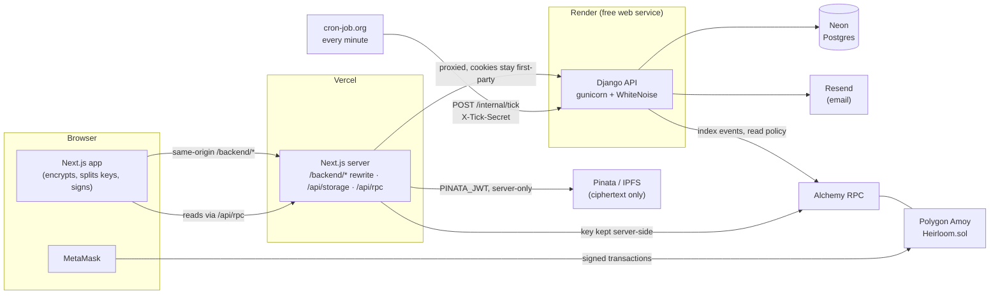

# Heirloom — trust-minimized digital inheritance

Files are encrypted in the browser (AES-256-GCM). The per-asset key is split with Shamir; each share is ECIES-encrypted to a
guardian's on-chain registered key. Ciphertext lives on IPFS (Pinata); the chain holds only hashes, public keys and encrypted shares.
```
contracts/  Hardhat + Solidity 0.8.24 (Heirloom.sol v2) — tests, deploy + verify scripts
web/        Next.js App Router + wagmi/viem + MetaMask
backend/    Django 5 + DRF + Postgres: sign-in, profiles, key blobs, invitations, chain indexer, notifications, claim alerts
render.yaml Render blueprint for the API;   DEPLOY.md  click-by-click free deployment
```

## Live
| | |
|---|---|
| Web app | _add the Vercel address after deploying: `https://<project>.vercel.app`_ |
| API health | _add the Render address: `https://<service>.onrender.com/health`_ |
| Contract (Polygon Amoy) | _add after `npm --prefix contracts run deploy:amoy`: `https://amoy.polygonscan.com/address/<address>`_ |

It runs entirely on free plans: **Vercel** (web), **Render** (Django), **Neon** (Postgres), **cron-job.org** (scheduler), Polygon Amoy testnet via Alchemy,
Pinata (files) and Resend (email). Follow [DEPLOY.md](DEPLOY.md).

## Architecture

The browser never holds a provider key or the Pinata JWT. The API has no background workers: the scheduler's tick (`POST /internal/tick`) does the indexing,
notifications, reminders and claim alerts in plain function calls, one bounded batch per minute.

## Threat model
| Who / what | Can | Cannot |
|---|---|---|
| **The Heirloom server (Render + Neon)** | See wallet addresses, names, emails, phones, who invited whom, the password-sealed key blobs, alert logs | Read any file, evidence or key: it never receives a plaintext key, and the sealed blob opens only with a password that never leaves the browser |
| **Vercel** | Serve the JavaScript, relay ciphertext to Pinata, relay read-only RPC calls | Read ciphertext contents; send transactions for anyone |
| **A passive attacker on the chain or IPFS** | See addresses, policies, salted fingerprints, encrypted shares, crypto amounts, timing and sizes | Decrypt anything |
| **One guardian** | Open their own share, review evidence, approve / reject / flag | Open a file alone; release early |
| **A threshold of colluding guardians + a beneficiary** | Release a file early | Do it unseen: the claim, approvals and challenge period are public events, and any check-in by the owner voids the claim |
| **Someone who steals the sealed key blob** | Guess passwords offline | Be fast: PBKDF2-SHA256 at 600,000 rounds; a long unique password is what protects it |
| **A compromised web host or CDN** | Serve altered JavaScript, which could capture a password or key | (This is the main residual risk; reproducible builds are future work.) |
| **A stranger who learns the tick URL** | Nothing | Run it: it needs the `X-Tick-Secret` header (compared in constant time) |
| **A stranger who learns an "I'm alive" link** | See the claim number and the owner's address | Check in for the owner: only a transaction signed by the owner's wallet counts |

Not defended: metadata (which addresses are guardians and beneficiaries, when, how large), a lost password with no recovery file, UIDAI deanonymizing an Aadhaar holder,
and bugs in unaudited contracts. See `/security` in the app for the user-facing version.

## Free-tier limitations
- **Cold starts.** A free Render service sleeps after 15 minutes without traffic and takes up to a minute to wake. The scheduler's call every minute normally keeps it
  awake; if it stops, the first visitor waits, and the page says "Waking up the server". Render's free hours (750 a month) cover one always-awake service.
- **Testnet only.** The contract runs on Polygon Amoy: no real value, and the chain can be reset or pruned by its operators. It is an unaudited prototype.
- **Anon Aadhaar is pre-production.** The deployment trusts the library's published **test** public key (`ANON_AADHAAR_MODE=test`), so only test QR codes verify; real
  Aadhaar QR codes are rejected. Switching to `real` is a redeploy, and the package is a pre-1.0-style SDK that has not had a production audit. Proving also downloads a
  ~600 MB circuit key in the browser.
- **Email.** Resend's shared sender `onboarding@resend.dev` only delivers to the account owner's own address, so invitations to other people need a verified domain.
  SMS (Twilio) is off by default (`SMS_ENABLED=false`).
- **RPC limits.** Alchemy's free plan allows `eth_getLogs` over only 10 blocks, so log queries go to a second public endpoint (`LOGS_RPC_URL_80002`) in small chunks.
  Public RPCs rate-limit; heavy use needs a paid plan.
- **Database.** Neon's free database sleeps when idle (about a second to wake) and has a storage cap. Rate-limit counters and sign-in nonces live in it too.
- **One instance.** The API runs one gunicorn worker with threads; there is no horizontal scaling, and a deploy briefly interrupts requests.
- **Files.** Pinata's free plan has storage and bandwidth caps; downloads through the shared public gateway can be slow (use a dedicated gateway).

## Setup
```bash
npm run install:all
npm run backend:setup                  # creates backend/.venv and installs the Python requirements
cp web/.env.example web/.env.local     # set PINATA_JWT (server-side only) and BACKEND_URL
cp backend/.env.example backend/.env   # set DJANGO_SECRET_KEY (and DATABASE_URL for Neon; SQLite is used when it is empty)
cp contracts/.env.example contracts/.env   # only needed to deploy to a public network
```
No Docker, Redis or Celery. The backend needs Python 3.12+.

## Local development
```bash
npm run backend:dev    # migrates, then serves the API on http://127.0.0.1:8000 (BACKEND_PORT to change)
npm run dev            # hardhat node :8545 → compile + deploy → Next.js :3000
npm run backend:tick:watch   # a local stand-in for cron-job.org: calls /internal/tick every 15 s (needs TICK_SECRET in backend/.env)
```
Three terminals. Without the tick, the app works but nothing happens in the background: no indexing (so no Audit page rows from the API, no notifications), no reminders.
| Command | What it does |
|---|---|
| `npm run dev` | Starts everything once. First checks that ports 3000 and 8545 are free and, if not, stops with the PID and the exact fix instead of half-starting. Deploys the **real** Anon Aadhaar verifier in test mode (identity proofs need the Anon Aadhaar SDK and a test QR). |
| `npm run dev:clean` | Stops stale Heirloom dev servers (an old `next dev`, an old Hardhat node) on 3000/3001/8545, then `npm run dev`. It never touches a process that is not clearly this project's. |
| `npm run dev:mock` / `dev:mock:clean` | Same, but with the local **test double** for identity (`ANON_AADHAAR_VERIFIER=mock`, `NEXT_PUBLIC_ZK_PROVER=mock`): enter a made-up person id instead of an Aadhaar QR. Handy for trying the whole app without the 600 MB circuit key. |
| `npm run ports:free` | Just the cleanup, without starting anything. |

The Hardhat node listens on 127.0.0.1 only (its accounts and keys are public, so never expose it). The browser only talks to Next.js; `/backend/*` is proxied to the API
(`BACKEND_URL` in `web/.env.local`). Deploying writes the ABI and address to `web/src/lib/contracts.ts` and `backend/chain/` (a local chain goes in the git-ignored
`deployments.local.json`; public networks go in the committed `deployments.json`).

**If the app keeps "loading" or says Heirloom isn't on Localhost:** the page and the chain disagree. A restarted local chain starts empty and is redeployed, so an
open tab holds the old address. The app now says so instead of spinning. Make sure only one `npm run dev` is running (`npm run dev:clean` guarantees that), wait for
`Heirloom deployed to …`, then hard-reload the page. Stopping the chain also stops the web server on purpose: `npm run dev` runs them as one unit. After a restart you
also need to re-register your encryption key (the chain forgot it) and sign in again if the backend was flushed.
If a wallet shows a red network-fee warning on Localhost, the account has no test ETH: list its address in `contracts/fund.local.json` and restart.

## Polygon Amoy (and Sepolia)
Put the secrets in `contracts/.env` (git-ignored; template in `contracts/.env.example`): `AMOY_RPC_URL`, `POLYGONSCAN_API_KEY`, `DEPLOYER_PRIVATE_KEY` (a throwaway account funded from the Amoy faucet).
```bash
npm --prefix contracts run deploy:amoy      # deploys, writes addresses/ABI/deploy block to contracts/deployments, web/ and backend/chain
npm --prefix contracts run verify:amoy      # publishes the source on Polygonscan
```
The deploy prints the `NEXT_PUBLIC_CHAIN_ID`, `NEXT_PUBLIC_CONTRACT_ADDRESS` and `NEXT_PUBLIC_CONTRACT_START_BLOCK` values to set in Vercel (the web app can also be
pinned to a deployment purely by these environment variables). `deploy:sepolia` / `verify:sepolia` work the same way. Set `NEXT_PUBLIC_IPFS_GATEWAY` to a dedicated Pinata gateway for reliable downloads.

### Test ERC-20 on Amoy (for trying crypto assets)
`TestToken` (HTT) is a worthless ERC-20 with a public `faucet()` (1,000 HTT per wallet per hour). It is for test networks only; the script refuses anything else.
```bash
export AMOY_RPC_URL=...  DEPLOYER_PRIVATE_KEY=...      # never commit these
npm --prefix contracts run deploy:token:amoy
```
The script writes `contracts/deployments/tokens/amoy.json` and regenerates `web/src/lib/contracts.ts`, so the Crypto tab offers HTT and a
"Get 1,000 test tokens" button on that network. (Local `npm run dev` deploys one automatically.) Commit the `tokens/amoy.json` record so everyone uses the same token.

## Languages (English, Hindi, Bengali)
The whole interface is translated with [next-intl](https://next-intl.dev): the landing and Security pages, every screen of the app, toasts, error messages, audit
event text and dates. Use the language switcher in the header; the choice is stored in the `NEXT_LOCALE` cookie (a year), so it survives reloads and sign-outs.
Until someone chooses, the browser's `Accept-Language` decides (English if it is none of the three).

* **Catalogues** live in `web/src/messages/<en|hi|bn>/<area>.json`. English is the source; message keys are type-checked against it, so a typo is a compile error.
* **`npm --prefix web run lint`** also runs `scripts/i18n.mjs check`: every language must have exactly the English keys with the same `{placeholders}` and `<tags>`
  (parsed with the real ICU parser), and no text-bearing attribute (`placeholder`, `title`, `aria-label`...) may be a literal. ESLint's `react/jsx-no-literals`
  rejects any literal text in JSX, so a string cannot be added without going through the catalogue. After adding a message file run `node web/scripts/i18n.mjs index`.
* **Adding a language:** add it to `web/src/i18n/config.ts`, `scripts/i18n.mjs` and `request.ts`, then translate each `en/*.json`.
* **Fonts:** Noto Sans Devanagari and Bengali are loaded for those scripts.
* **Not translated, on purpose:** the PDF audit report (its built-in fonts cannot draw Devanagari or Bengali, so it is always English); text produced by the backend
  (emails, notification bodies, API validation messages); proper nouns (Heirloom, MetaMask, network names) and the browser's own controls (file picker, date picker).

## Checks
```bash
npm test                          # contract tests
npm run backend:test              # API, indexer, notification, alert and scheduler tests (always on a throwaway SQLite database)
npm --prefix web run lint
npm --prefix web run typecheck
```

## Backend
**What it stores (off-chain only):** wallet address, name, email, phone, the password-sealed encryption key, and invitations.
Never files, plaintext keys, DEKs or shares. Nothing personal goes on-chain.

| Endpoint | Purpose |
|---|---|
| `POST /api/auth/nonce`, `POST /api/auth/verify` | Sign-In With Ethereum (EIP-4361). The server builds and stores the message, so the nonce is single-use and bound to the address, chain and frontend origin. A valid signature sets an httpOnly JWT cookie. |
| `POST /api/auth/logout` | Clears the cookie and revokes every token issued so far. |
| `GET/PUT /api/me` | Profile (name, email, optional phone). |
| `GET/PUT /api/key-blob` | The sealed encryption key. Strictly validated (fixed lengths, PBKDF2 ≥ 600k) so a raw key can never be stored by mistake; replacing it with a different key is refused. |
| `GET/POST /api/invites`, `DELETE /api/invites/<id>`, `POST …/resend` | The owner's invitations (guardian or beneficiary). |
| `POST /api/invites/preview`, `POST /api/invites/accept` | The invitee's side: a signed, expiring, single-use token from the emailed link. Accepting requires a completed profile whose email matches the invite, and a stored key. |
| `GET /api/contacts?role=` | Accepted invitees: the only people the owner can pick as guardians or beneficiaries in the app. |
| `GET /api/events` | Indexed contract events, newest first. Filters: `chain_id`, `asset_id`, `claim_id`, `actor`, `event`; paging with `limit` and `before_id`. Also returns each chain's indexer progress. |
| `GET /api/notifications`, `POST /api/notifications/read` | The signed-in user's in-app notifications (feeds the bell); mark by `ids` or `all`. |
| `GET/PUT /api/alerts/settings` | Alert channels (email, SMS), verification status, and the last alerts sent (kind, channel, status, time only). SMS can only be switched on for a verified phone. |
| `POST /api/alerts/verify/start`, `POST /api/alerts/verify/confirm` | Contact verification: a 6-digit code (10 min, 5 guesses, stored only as a keyed hash) sent to the email or phone on file. Changing a contact makes it unverified again. |
| `GET /api/alive/preview`, `POST /api/alive/consume` | The emailed "I'm alive" link (public; the signed token is the credential and grants no power by itself). `consume` checks on-chain that the claim is void, then retires the link. |

### Indexer and notifications
There are no background workers. An external scheduler (cron-job.org in production, `npm run backend:tick:watch` locally) calls **`POST /internal/tick`** every minute
with the `X-Tick-Secret` header (compared in constant time; without `TICK_SECRET` set the endpoint answers 503). One call is one bounded batch (about 24 s) of plain function calls:
1. **Index** (`indexer.runner`): reads the contract's logs with web3.py and stores every event in Postgres.
  - *Bounded:* it stops starting new block ranges when its share of the time budget is used, and carries on from `last_block` next minute.
  - *Idempotent:* a log is identified by (chain, tx hash, log index); replaying a block range never duplicates anything.
  - *Resumable:* progress is a per-deployment `last_block`, advanced in the same transaction as the rows it covers.
  - *Final:* only blocks buried under `CONFIRMATIONS_<chain>` blocks are indexed (0 locally, 4 Sepolia, 30 Amoy), so nobody is emailed about an event that a reorg could undo.
  - *Self-healing:* if the last indexed block is no longer canonical (a deeper reorg, or a reset local chain) orphaned rows are dropped and indexing resumes from the fork point.
2. **Notify**: new events become in-app notifications, emailed at once (Resend HTTP API).
3. **Remind**: heartbeat-due / overdue reminders to owners, attestation-deadline reminders to guardians who have not yet responded. "Now" is the chain's clock, because that is what the contract compares against.
4. **Escalate**: the claim-alert stages that have become due (below).
5. **Retry** emails that failed (up to 6 attempts, within a day).

*Safe to call twice at once:* a lease row (one compare-and-set `UPDATE`, which works behind a connection pooler) lets one call run; the other returns `{"skipped": ...}` immediately,
and a crashed run's lease expires after a minute. Each stage is idempotent and a failing stage never stops the next. Each notification is created at most once per person
(unique per user and event or reminder cycle), so replays and retries never repeat an email. `GET /health` reports the database and each chain's RPC (503 only if the database is down).

| Event | Who is notified |
|---|---|
| ClaimRaised | owner (urgent) and every guardian of the claim (urgent) |
| Attested, ClaimRejectedByGuardian | owner and the claimant |
| ClaimRejected | owner, claimant, guardians |
| FraudFlagged | owner (urgent), claimant, the other guardians |
| ClaimCancelled | claimant and guardians |
| ClaimFinalized | beneficiary, and guardians (urgent: release your share) |
| ShareReleased | beneficiary |

### Claim alerts (owner escalation)
When a claim is raised the owner must find out fast, because one check-in cancels it. The owner's email goes out in the same tick that indexes the `ClaimRaised` event, and
every later tick runs whatever has become due, so everything below is idempotent and retried:

| When | What |
|---|---|
| Immediately | **Email** to the owner with a one-time link `/alive?claim=<id>&t=<token>`. The page connects the owner's wallet and sends `heartbeat`, which invalidates the claim on-chain. |
| `ALERT_SMS_AFTER_SECONDS` later (default 72 h), no check-in yet, challenge still running | **SMS** (Twilio) with a fresh single-use link. Only to a *verified* number, and only if the owner enabled SMS. |
| `ALERT_GUARDIAN_BEFORE_END_SECONDS` before the challenge ends (default 24 h) | Guardians who have not responded are alerted (in-app + email). Skipped when the challenge is shorter than that window, because the "claim raised" alert already was the warning. |

* **The link.** Signed, names only an internal id, and expires **when the challenge period ends** (chain time). It is single use: after the check-in the page calls
  `consume`, the server confirms `isClaimInvalidated` on-chain, and every link for the claim is retired. It never moves anything by itself: only a transaction signed by the
  owner's wallet counts, and another wallet is told to switch. Closed, cancelled, finalized or already-checked-in claims stop all escalation.
* **Settings** (Account page): email on/off, SMS on/off, and contact verification by code. Email alerts go to the address on file even if unverified (better to reach you than
  to stay silent); SMS goes only to a verified number, because a mistyped number could text a stranger.
* **Twilio.** Off by default. Set `SMS_ENABLED=true` and `TWILIO_ACCOUNT_SID`, `TWILIO_AUTH_TOKEN`, `TWILIO_FROM_NUMBER`. Otherwise SMS alerts and phone verification are off (the Account page says so).
  `SMS_BACKEND` can point at another provider class (`available()` and `send(to, body)`).
* **The log.** Every attempt is a row in `AlertLog` (kind, channel, sent/failed/skipped, short reason, provider message id, time) and one log line. Neither holds an email address,
  phone number, name, wallet address, link or message text. A failed attempt is retried until it is sent; only a sent alert stops further tries.

Only people with a Heirloom account are notified; others are skipped. The audit page reads from `/api/events` and falls back to reading the chain
directly if the indexer is unreachable, stalled, reporting an error, or more than 200 blocks behind.

**Security notes**
- Rate limits (kept in the database cache, shared by every worker): nonce 30/min, verify 10/min, invite preview 30/min, invite create 30/h, resend 10/h, per client IP. Set
  `NUM_PROXIES` to the number of reverse proxies in front of the API (2 behind Vercel + Render) so IPs cannot be spoofed.
- Cookie: httpOnly, `SameSite=Lax`, `Secure` outside `DJANGO_DEBUG`. State-changing requests whose `Origin` is not in `ALLOWED_ORIGINS` are rejected; CORS allows only that origin.
  Production settings: `DEBUG` off, `ALLOWED_HOSTS` from the environment, HSTS, HTTPS redirect, `CSRF_TRUSTED_ORIGINS`.
- Restricting the owner to accepted contacts is enforced in the app. The contract itself accepts any address that has registered a key,
  so a modified client could still add someone else.
- `DJANGO_DEBUG` must be `0` in any shared environment (it relaxes the cookie and returns invite links in responses).

## How it works
1. **Onboarding** — connect a wallet and sign in with Ethereum, add your name and email (off-chain), then the browser generates a
   secp256k1 encryption keypair and you set an encryption password (PBKDF2-SHA256 600k → AES-GCM seals the private key). The sealed
   key is stored on the server so it follows you to other devices; you also download a recovery file, and the public key is
   registered on-chain. The unlocked key exists only in memory for the session.
2. **Owner** — invites guardians and beneficiaries by email (People tab). Once they accept, creates a vault from those contacts
   (3–7 guardians with registered keys, Shamir threshold, check-in interval), reserves files for
   beneficiaries under a policy, checks in with *I'm alive*, can cancel claims and panic-freeze the vault.
3. **Beneficiary** — sees reserved files (never content), raises a claim with encrypted evidence once the owner has been silent
   long enough, finalizes after the challenge period, then decrypts once enough guardians released their shares. The SHA-256 of
   the result is checked against the on-chain hash ("Integrity verified").
4. **Guardian** — decrypts and previews the claim's evidence in the browser (approval stays locked until they have), then
   approves / rejects / flags fraud; after finalization re-encrypts their share to the beneficiary.
5. **Audit** — every contract event with readable labels, filters (asset, claim, event type, actor, "only mine") and explorer links.
   **Export PDF report** builds, in the browser, a chronological report of the filtered events with full transaction hashes (linked to the explorer),
   senders, the contract address and a per-event summary.
6. **Account** — edit your details, verify your identity (optional, zero-knowledge), download a recovery file, and change your encryption password (see Recovery below).
7. **Security page** (`/security`) — lists exactly what the blockchain, the server and the storage provider each hold, and why none can decrypt.

### Reserving a file or a final letter
The owner can reserve either a file or a **final letter**: text written in the app, encrypted exactly like a file (same key, shares and policy). The
beneficiary sees it rendered on screen after release (as plain text, never HTML) with copy and download buttons, and the owner can read their own copy.
A letter is just a file whose hidden name ends in `.letter.txt`, so nothing about the contract or the server changes.

The content fingerprint stored on-chain is `SHA-256(salt || content)`, with the 32-byte random salt kept inside the encrypted file, so a short or guessable text
cannot be confirmed by hashing guesses. The beneficiary recomputes it after decrypting ("Integrity verified"). The same applies to evidence.

### Crypto assets
Instead of a file, an asset can hold **native currency (MATIC/POL on Polygon) or any ERC-20**, locked in the Heirloom contract for a beneficiary.

* **Same rules.** The asset carries the same policy (approvals, challenge period, inactivity, unlock time, evidence type, identity checks) and the same claim,
  guardian-approval, fraud-flag and heartbeat rules as a file. There is nothing to encrypt, so there are no key shares: guardians only approve.
* **Pull payments.** `finalizeClaim` only marks the asset released; it moves no money. The beneficiary then calls `withdraw(assetId)` and receives the funds
  (checks-effects-interactions, plus `nonReentrant` on every function that moves value; ERC-20s go through OpenZeppelin `SafeERC20`).
* **Owner control.** The owner can `topUp` or `ownerWithdraw` any time **while no claim is open**. While a claim is `Raised` both are blocked, even if a check-in
  has since voided it: the owner must cancel the claim (an on-chain, auditable action) before moving funds. After release the funds belong to the beneficiary.
* **Honest accounting.** The balance credited is what actually arrived, so fee-on-transfer tokens cannot make the books exceed the real balance. A claim on an
  empty asset is refused. Events: `CryptoDeposited`, `CryptoWithdrawn`, `CryptoClaimed` (shown in the audit page and PDF).
* **Privacy.** Unlike files, **amounts and token addresses are public on the blockchain**; the app says so where you create one. The beneficiary does not need a
  registered encryption key to receive funds.

Tests: `contracts/test/Crypto.test.js` (deposits, top-up, withdraw, blocked-during-claim cases, pull pattern, fee-on-transfer, identity policies, and
reentrancy through a malicious token and through a malicious beneficiary and owner contract).

### Replacing guardians
**Replace guardians** is one flow: it first opens every sealed file's key with the owner's encryption key (so a problem is found before anything changes
on-chain), reads the new guardians' registered public keys, re-splits every key for the new set, then sends `rotateGuardians` and one `updateAssetShares` per
file (one wallet confirmation each). If the flow is interrupted after the guardians change, the file shows **Needs re-share** with a button to finish it. A
warning appears if a file asks for more approvals than the new set has guardians. Released files are final and are left alone.

### Recovery
- **Recovery file.** Created at sign-up and re-downloadable from the Account page. It is the same sealed key as the one stored on the server, so it opens with the
  password it was created with. On the unlock screen, *Forgot your password? Use a recovery file instead* replaces the stored copy with the chosen file (same key
  only; another account's file is rejected) and you unlock it with that file's password.
- **Change password** (Account page) re-seals the same key under a new password and downloads a new recovery file. Older files still need the old password.
- **If both the password and every recovery file are lost, nothing can recover the key**, by design. Guardians still hold their shares, so a claim can be approved and
  released to the beneficiary, but the owner can no longer open their own copy or re-share files after replacing guardians.
- **Future work: guardian-assisted recovery** (not built). The owner registers a new encryption key from their wallet; guardians (at their threshold) each re-encrypt
  their share of a file's key to the new key after a waiting period in which the old key can cancel the request, and the owner rebuilds each key locally. It needs
  a new contract path (a recovery request with its own challenge window, the fraud flag and a freeze) and an abuse analysis before shipping.

### Evidence
The beneficiary's evidence file is encrypted with a fresh AES-256-GCM key. That key is ECIES-wrapped to each guardian and the
owner, and the wraps are stored inside the encrypted bundle on IPFS. On-chain there is only `evidenceHash` (SHA-256 of the
plaintext) and the bundle's storage id. Guardians check the decrypted file against that hash before relying on it.

## Problem-statement coverage
| Requirement | How Heirloom meets it |
|---|---|
| Secure access control | Files are AES-256-GCM encrypted in the browser; the key is Shamir-split and each share is ECIES-encrypted to a guardian. Nothing opens before the contract reaches `Finalized`. |
| No single party can access secrets | Server and chain only hold ciphertext, hashes and encrypted shares. A guardian alone holds one share, which reveals nothing. |
| Unavailability detection without one signal | A claim needs all of: owner silence past `minInactivity` (heartbeat), beneficiary evidence with an on-chain hash, guardian approvals, and an elapsed challenge period. An inactivity timer alone never releases anything. |
| Recovery authorization | Independent guardians review the decrypted evidence and approve, reject, or flag fraud; `requiredApprovals` must be met. |
| Emergency intervention | Owner can check in (voids any open claim), cancel a claim, or panic-freeze the vault. A guardian fraud flag blocks a claim. |
| Conditional access | Per-asset policy: beneficiary, approvals, challenge period, inactivity, evidence type, time lock (`unlockAfter`), attestation deadline. |
| Failure handling | After `attestationDeadline`, the guardian threshold suffices if guardians are unresponsive. Owners can replace guardians and re-share assets, and can always open their own copy. |
| Auditability | Every action emits an event; the Audit page lists them with filters and explorer links. |

Known limits: guardians are trusted to review honestly (a threshold of them colluding with a beneficiary could release early,
which is why the owner's challenge period and check-in exist), and the contract is unaudited.

## Zero-knowledge identity (Anon Aadhaar)
Optional, per vault and per file. People can prove, in zero knowledge, that they hold a valid Aadhaar, so one person cannot pose as several guardians or
claim as someone else. **No Aadhaar data ever leaves the browser, and nothing but a pseudonym reaches the chain.**

| Rule | Where it is enforced |
|---|---|
| `verifyIdentity(proof)` binds an address to a **nullifier** (a per-app pseudonym). One nullifier per address, one address per nullifier, so a person cannot verify two wallets. | `Heirloom.sol` |
| The proof's **signal binds to `msg.sender`** (and chain, contract, purpose), so a proof copied from the mempool is useless to anyone else. Emits `IdentityVerified(account, nullifier)`, no personal data. | `Heirloom.sol` |
| **Verified guardians** (`requireVerifiedGuardians`, set in `createVault` / `rotateGuardians`): every guardian must hold a verified identity; their nullifiers are necessarily distinct. | `Heirloom.sol` |
| **Beneficiary identity** (`requireBeneficiaryZK`, asset policy): `raiseClaim` needs a fresh proof whose nullifier is the beneficiary's registered one, signal bound to the claim id. | `Heirloom.sol` |
| **Over 18** (`requireAge18`, asset policy): `finalizeClaim` needs a proof of the beneficiary's identity that reveals `ageAbove18 = 1`. Only that bit is revealed; no date of birth is stored. | `Heirloom.sol` |
| **Freshness**: proofs must be at most 3 hours old. The Anon Aadhaar verifier does not check this, so Heirloom does (QR timestamps are rounded to the hour). | `Heirloom.sol` |

Signals are `keccak256(domain, chainId, contract, id, address)` with separate domains for identity, claim and age, so a proof made for one purpose cannot be
replayed for another, on another chain, or for another claim. A claim proof is bound to the id the claim is about to get; if someone else's claim lands first the
id moves and the proof must be regenerated (the app detects this and asks you to retry).

**Packages** (checked against npm on 2026-10-04): `@anon-aadhaar/react`, `@anon-aadhaar/core` and `@anon-aadhaar/contracts` all at **2.4.3** (published
Dec 2024). The React package declares a peer of React 18; the app runs React 19, so `web/package.json` carries npm `overrides` to give both packages the app's single
React. `@anon-aadhaar/core` ships TypeScript source that does not pass our strict type-check, so `web/src/vendor/anon-aadhaar-core` is a type facade that re-exports
the real package for the bundler (see the comment there). The SDK is loaded lazily, only when someone starts a proof.

**Deploying the verifier** (`contracts/scripts/deploy.js`):
| Env | Effect |
|---|---|
| *(default)* | Deploys the official Groth16 `Verifier` and `AnonAadhaar` from `@anon-aadhaar/contracts`. |
| `ANON_AADHAAR_MODE=test` (default) / `real` | Which UIDAI public key the verifier trusts: the published **test** key (accepts only test QR codes) or the production key (accepts only genuine Aadhaar QR codes). |
| `ANON_AADHAAR_VERIFIER=0x…` | Point at an existing AnonAadhaar contract instead of deploying one. I found no official Amoy deployment in the docs, so on Amoy the default deploys one. |
| `ANON_AADHAAR_VERIFIER=none` | Identity features disabled on this deployment. |
| `ANON_AADHAAR_VERIFIER=mock` | A **test double** that accepts any "proof" committing to the right inputs. Local chains only, refused elsewhere. |
| `ANON_AADHAAR_NULLIFIER_SEED` | This app's seed (default: `keccak256("heirloom.anon-aadhaar.v1") >> 8`). |

**Frontend flags:** `NEXT_PUBLIC_ANON_AADHAAR_MODE=test|real` (which QR codes the SDK accepts; must match the verifier, the app warns if not; defaults to the deployment's)
and `NEXT_PUBLIC_ZK_PROVER=mock` (local test double, only with a locally deployed mock verifier). For a full local run without the 600 MB circuit key:
`ANON_AADHAAR_VERIFIER=mock NEXT_PUBLIC_ZK_PROVER=mock HARDHAT_HOST=0.0.0.0 npm run dev`. Real proving downloads about 10 MB of WASM and **about 600 MB of proving
key on first use** (cached afterwards), needs several GB of memory and takes a minute or two.

**In the app:** onboarding offers an optional *Verify identity (zero-knowledge)* step (skippable; also on the Account page) with a plain statement that Aadhaar data
stays in the browser. Verified guardians and beneficiaries get a badge (People, vault, pickers). Owners can tick *Require verified guardians* (vault) and *identity proof to claim* /
*over-18 proof to finalize* (per file). Beneficiaries are walked through the proof when they raise a claim or finalize.

**What is and is not tested.** Hardhat tests cover every rule above against a mock verifier (`test/Identity.test.js`), including that the SDK's own `hash()` equals the contract's
signal hash, and that the **real** `Verifier` + `AnonAadhaar` contracts deploy under our compiler and reject junk cleanly (`test/RealVerifier.test.js`). The browser flow is exercised
end to end with the local test double (identity step, one person one wallet, verified guardians, identity proof to claim, proof of age to finalize, badges). A second browser
check runs the app against the **real** verifier deployment with the **real SDK**: the UI and test-mode notice render, the SDK loads in the React 19 / Turbopack bundle, and
non-Aadhaar input is refused with a clear message. **A real proof (genuine or test QR, real circuit) has not been generated or verified on-chain in this repository**: it needs a signed
QR and the 600 MB proving key. Try it once on a testnet with a test QR from the Anon Aadhaar documentation before relying on it. UIDAI, as the issuer, can in principle deanonymize holders; the protocol hides identities from everyone else.

## Storage API
`POST /api/storage` (`Content-Type: application/octet-stream`, ≤ 25 MB) pins ciphertext to Pinata using the server-side
`PINATA_JWT` and returns `{ cid }`. The route is unauthenticated; put rate limiting / auth in front of it before exposing it publicly.
